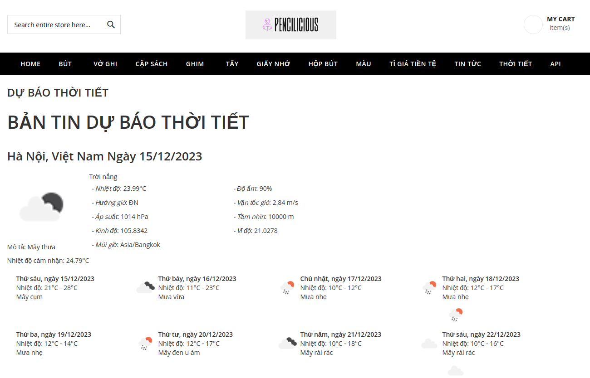
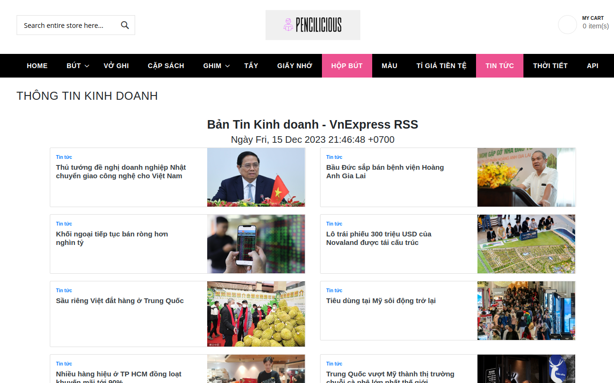
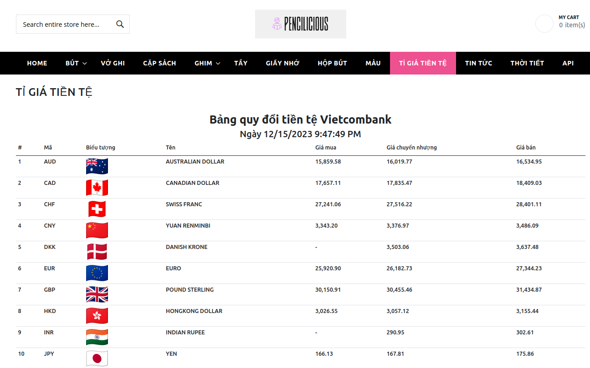
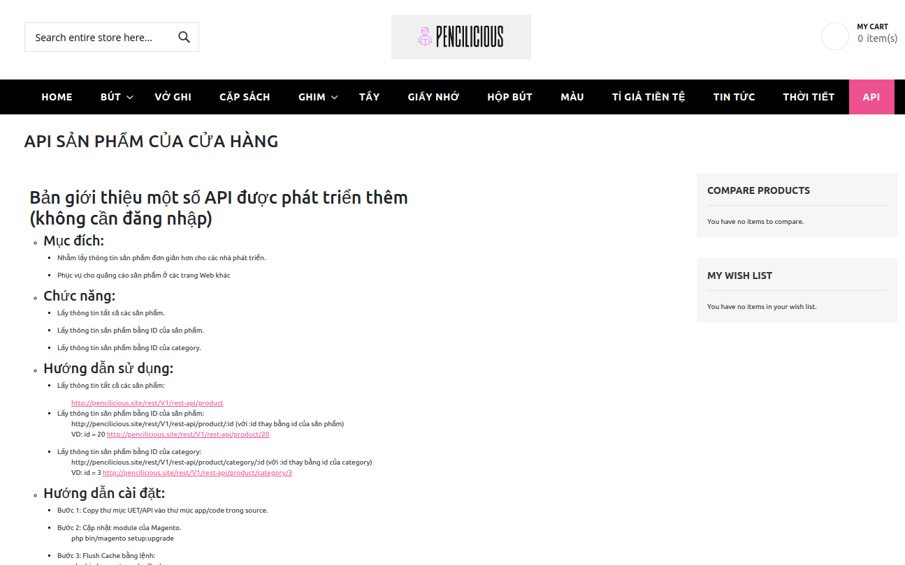

# 
 MAGENTO-MODULES

## **1. Introduction**

Final project in the e-commerce system course.

Team Members: Trịnh Ngọc Huỳnh (20020054), Nguyễn Như Thảo (21020402) and Nguyễn Hoài Ngân (21020363)
.
## **2. Integration with magento**
### **Clone the repository**

    https://github.com/huynhspm/magento-modules

### **Set up Magento**
We follow the instructions from this repository: [Docker Magento 2](https://github.com/markshust/docker-magento)

### **Integrate modules**
Copy folder **UET** in this repository to folder **code** of magento. Then enable all modules and execute Magento update commands
## **3. Modules**
### **Weather**
Module provides users with weather information for the area, including the next seven days. Code used api from
[Weather API](https://openweathermap.org/themes/openweathermap/assets/vendor/mosaic/data/wind-speed-new-data.json)

### **News**
Module provides users with the latest news obtained from a vnexpress source. Code used api from
[News API](https://vnexpress.net/rss/kinh-doanh.rss)

### **Currency exchange rate**
Module provides users with information on currency exchange rates for some popular currencies worldwide. Code used api from
[Currency exchange rate API](https://portal.vietcombank.com.vn/Usercontrols/TVPortal.TyGia/pXML.aspx?b=68)

### **API System**

The API allows retrieving information about the store's products in XML or JSON format without accessing the store's interface. This is intended to gather product information for store advertising, showcasing products outside the store.

